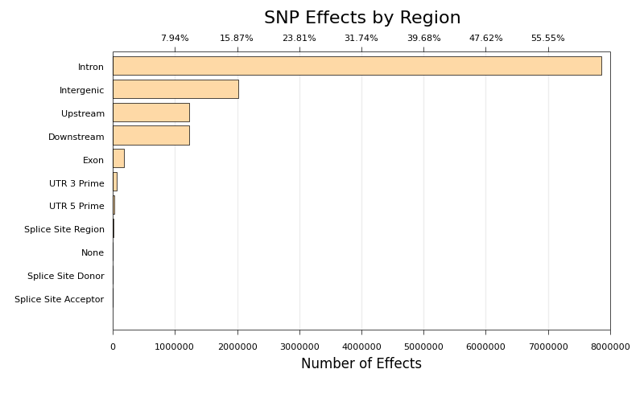

# Sample Information

Report Date
:   2014-11-13

Recipient
:   phil.ewels@scilifelab.se

Project Name
:   M.Kaller_14_05

User Sample Name
:   Test Sample #1290

NGI Sample Name
:   P1170_101

Library Prep Method
:   **A:** All samples were sequenced on HiSeq2500 (HiSeq Control Software
    2.0.12.0/RTA 1.17.21.3) with a 2x101 setup.The Bcl to Fastq conversion was
    performed using bcl2Fastq v1.8.3 from the CASAVA software suite. The
    quality scale used is Sanger / phred33 / Illumina 1.8+.

Sequencing Centre
:   NGI Stockholm

Sequencing Platform
:   Illumina

Reference Genome
:   `gatk_bundle/2.8/b37/human_g1k_v37.fasta`

Flow Cells
:   `140815_SN1025_0222_BC4HAPACXX`

    `140815_SN1025_0223_BC4HAPACXX`

# Library Statistics

Total Reads
:   908,585,160

Aligned Reads
:   99.47% -  903,806,933

Duplication Rate
:   1.9%

Median Insert Size
:   369 bp

Av. Autosomal Coverage
:   28.92X

&ge; 30X Coverage
:   51.72% of reference

GC Content
:   39.87%

See below for more information about coverage and insert size. The
`qualimapReport.html` report in your delivery folder contains additional library
statistics. Note that the duplication rate above is calculated using
[Picard Mark Duplicates](http://broadinstitute.github.io/picard/command-line-overview.html#MarkDuplicates).
Qualimap calculates duplicates differently and the figure in
the report will be different to the Picard result..

## Distribution of sequencing coverage
Calculating the coverage of a genome tells you how much information you have
about the sequence content of any given position. More coverage means more data
and so greater confidence in your results. A specific locus with 30X coverage
will have 30 unique reads covering that location. Different positions in the
genome may have different coverages due to variations in how well reads map to
the underlying sequence. Other factors such as GC bias in library preparation
may also have an effect.

To calculate the plot below, we create rolling windows across the genome and
count the frequencies of the different coverages observed. This was done using
the [QualiMap](http://qualimap.bioinfo.cipf.es/) tool and plotted with an
[NGI script](https://github.com/SciLifeLab/visualizations).

## Proportion of library with increasing coverage depths
Another way to assess coverage is to look at the proportion of the reference
genome with a certain coverage. The plot below shows what percentage of the
reference genome is covered with increasing coverage thresholds. As above, this
data was calculated using [QualiMap](http://qualimap.bioinfo.cipf.es/) and plotted
with an [NGI script](https://github.com/SciLifeLab/visualizations).

## Library fragment insert sizes
By inspecting where each read pair maps to in the reference genome, we can
reconstruct the reads that were present in the library and calculate the range
of insert sizes. This gives an insight into the quality of the sequencing
library. We counted how many reads with each insert size were seen and plotted
this in the histogram below. This was done using the
[QualiMap](http://qualimap.bioinfo.cipf.es/) tool and plotted with an
[NGI script](https://github.com/SciLifeLab/visualizations).

## Distribution of reads by GC content
Library preparation and sequencing alignment can be affected by differences in
GC content. Here, we plot the proportions of the library reads at each GC
content. The red dotted line shows the profile for the reference genome. 
This data was calculated using [QualiMap](http://qualimap.bioinfo.cipf.es/)
and plotted with an [NGI script](https://github.com/SciLifeLab/visualizations).

# Variants

Change Rate
:   1 change per 774 bp

Total SNPs
:   4,004,647

Homotypic SNPs
:   1,491,592

Heterotypic SNPs
:   2,513,055

Ts/Tv Ratio
:   1.9895

Synonymous SNPs
:   35,078

Non-Synonymous SNPs
:   30,232

Stop Gained / Lost
:   273 / 58

Missense SNPs
:   46.2%  -  30,366

Nonsense SNPs
:   0.4%  -  273

Silent SNPs
:   53.4%  -  35,078

Different effects can be attributed to each SNP depending on where it occurs.
Here we have used the [snpEff](http://snpeff.sourceforge.net/) tool to
categorise and count different effects. The results were plotted with an
[NGI script](https://github.com/SciLifeLab/visualizations).

See the `snpEff_summary.html` report in your delivery folder for more details.

